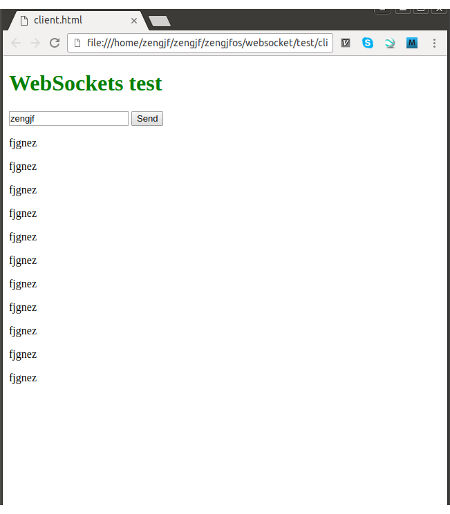

# WebSocket Sample ---- libwebsockets Simple Example

# Refers

* [how to install libwebsocket library in linux?](https://stackoverflow.com/questions/29470447/how-to-install-libwebsocket-library-in-linux)
* [bjardnin/index.html](https://gist.github.com/bjardnin/1df8cc5eb43ce5008f7e#file-libwebsockets-websocket-c)
* [Shared library compilation gcc](https://stackoverflow.com/questions/28271405/shared-library-compilation-gcc)
* [libwebsockets libwebsockets-webserver.c hacking](http://www.cnblogs.com/zengjfgit/p/6973368.html)

# How Make It Work

* `sudo apt-get install libwebsockets-dev`
* `cd src`
* `make`
* `./lwsserver`

# Output Picture

* Terminal Output
    ```
        zengjf@zengjf:~/zengjf/zengjfos/websocket$ ls
        main.c  Makefile  README.md  test
        zengjf@zengjf:~/zengjf/zengjfos/websocket$ make
        gcc main.c -lwebsockets -o lwsserver
        zengjf@zengjf:~/zengjf/zengjfos/websocket$ ls
        lwsserver  main.c  Makefile  README.md  test
        zengjf@zengjf:~/zengjf/zengjfos/websocket$ ./lwsserver 
        [2017/05/10 16:46:57:7205] NOTICE: Initial logging level 7
        [2017/05/10 16:46:57:7205] NOTICE: Libwebsockets version: 1.7.3 unknown-build-hash
        [2017/05/10 16:46:57:7205] NOTICE: IPV6 not compiled in
        [2017/05/10 16:46:57:7205] NOTICE: libev support compiled in but disabled
        [2017/05/10 16:46:57:7206] NOTICE:  Threads: 1 each 1024 fds
        [2017/05/10 16:46:57:7206] NOTICE:  mem: platform fd map:  8192 bytes
        [2017/05/10 16:46:57:7206] NOTICE:  mem: per-conn:          832 bytes + protocol rx buf
        [2017/05/10 16:46:57:7206] NOTICE:  canonical_hostname = zengjf
        [2017/05/10 16:46:57:7206] NOTICE:  Compiled with OpenSSL support
        [2017/05/10 16:46:57:7207] NOTICE:  Using non-SSL mode
        [2017/05/10 16:46:57:7227] NOTICE:  SSL ECDH curve 'prime256v1'
        [2017/05/10 16:46:57:7227] NOTICE:  Listening on port 9000
        starting server...
        connection established
        received data: zengjf
        received data: zengjf, replying: fjgnez
    ```
* Browser Output([test/client.html](test/client.html))  

